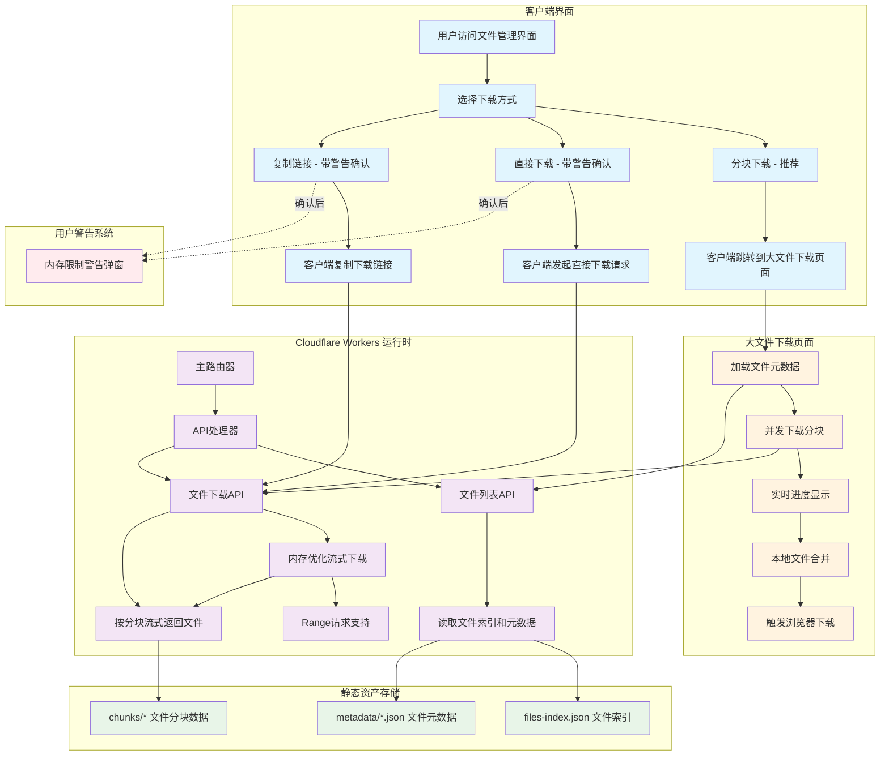

# Cloudflare R2 大文件管理系统

## 📋 项目概述

这是一个基于 **Cloudflare Workers + Static Assets** 的大文件管理系统，专门为处理大文件（GB级）设计，支持内存优化的流式下载、分块处理和断点续传。

## 🏗️ 系统架构



## 📁 项目结构

```
cloudflareR2/
├── workers-migration/          # 🚀 Cloudflare Workers 项目 (生产环境)
│   ├── src/
│   │   └── index.js           # Worker 主入口文件 - 处理API和静态资产路由
│   ├── static/                # 静态资源目录 (通过 Workers Static Assets 服务)
│   │   ├── index.html         # 文件管理界面 - 支持智能下载模式选择
│   │   ├── large-file-downloader.html  # 大文件下载页面 - 并发分块下载
│   │   ├── files-index.json   # 文件索引 - 记录所有文件基本信息
│   │   ├── metadata/          # 文件元数据目录
│   │   │   └── *.json         # 单个文件的详细元数据（分块信息、哈希等）
│   │   └── chunks/            # 文件分块存储目录
│   │       └── *              # 二进制文件分块数据
│   ├── package.json           # Worker 项目依赖配置
│   └── wrangler.toml          # Cloudflare Worker 部署配置
├── src/                       # 🛠️ 本地开发服务器 (用于文件上传和分块)
│   └── server.js              # Express 本地服务器
├── public/                    # 📁 本地静态文件目录
├── setup.js                   # 🔧 项目初始化脚本
├── package.json               # 根项目依赖配置
└── README.md                  # 📖 项目完整文档
```

## ✨ 核心功能特性

### 🚀 **内存优化流式下载**
- **极简内存管理**: 一次只处理一个分块（bufferSize = 1）
- **强制垃圾回收**: 每个分块处理后立即清理内存
- **Content-Length支持**: 避免chunked编码，支持下载进度显示
- **大文件支持**: 可处理2GB+文件而不会内存溢出
- **智能警告系统**: 直接下载和复制链接时提醒用户内存限制风险

### 🔄 **智能下载策略**
- **自动检测**: 文件 > 500MB 自动重定向到专用下载页面
- **直接下载**: 小文件直接流式下载，支持Range请求
- **分块下载**: 大文件并发分块下载+浏览器本地合并
- **断点续传**: 完整的Range请求支持，兼容专业下载工具
- **用户选择**: 提供三种下载方式供用户选择

### 🌐 **自定义域名支持**
- **动态URL检测**: 自动适配任何绑定的域名
- **无硬编码**: 不依赖特定域名配置
- **CORS支持**: 完整的跨域请求支持

### 📱 **用户体验优化**
- **智能识别**: 前端自动识别大文件并在文件列表中标注
- **三种下载方式**: 分块下载（推荐）、直接下载、复制链接
- **安全提醒**: 直接下载和复制链接时弹窗警告内存限制风险
- **进度显示**: 实时显示下载和合并进度
- **错误处理**: 完善的错误提示和重试机制
- **响应式设计**: 支持桌面和移动端使用

## 🔧 技术实现详解

### 1. **内存优化流式响应**

```javascript
// 核心优化策略 (workers-migration/src/index.js:238-289)
async function createStreamingResponse(metadataJson, filenameHeader, env, workerUrl) {
  const stream = new ReadableStream({
    async start(controller) {
      const chunks = metadataJson.chunks;
      const bufferSize = 1; // 🔑 关键：一次只处理一个分块
      
      try {
        for (let i = 0; i < chunks.length; i++) {
          const chunk = chunks[i];
          
          // 获取分块数据
          const chunkRequest = new Request(`${workerUrl}/chunks/${chunk.id}`);
          const chunkResponse = await env.ASSETS.fetch(chunkRequest);
          const chunkArray = new Uint8Array(await chunkResponse.arrayBuffer());
          controller.enqueue(chunkArray);
          
          // 🔑 关键：强制垃圾回收
          await new Promise(resolve => setTimeout(resolve, 0));
        }
        controller.close();
      } catch (error) {
        controller.error(error);
      }
    }
  });
  
  return new Response(stream, {
    status: 200,
    headers: {
      'Content-Type': 'application/octet-stream',
      'Content-Length': metadataJson.size.toString(), // 🔑 关键：保持Content-Length
      'Accept-Ranges': 'bytes',
      // ... 其他头部
    }
  });
}
```

### 2. **大文件智能检测和重定向**

```javascript
// 服务端检测和重定向 (workers-migration/src/index.js:155-159)
const LARGE_FILE_THRESHOLD = 500 * 1024 * 1024; // 500MB
if (metadataJson.size > LARGE_FILE_THRESHOLD) {
  return redirectToLargeFileDownloader(fileId);
}

// 前端智能检测 (workers-migration/static/index.html:433-436)
function downloadFile(fileId, fileName, fileSize) {
    // 🔑 直接跳转到分块下载页面，这是最稳定的方式
    window.location.href = `/large-file-downloader.html?fileId=${fileId}`;
}

// 直接下载带警告提醒 (workers-migration/static/index.html:439-451)
function directDownload(fileId, fileName) {
    // 弹窗提醒用户关于内存限制的问题
    const confirmed = confirm('因为Cloudflare Worker的内存限制，哪怕代码中已经尽量规避，完整直接下载大文件依然可能导致失败，建议使用分块下载。\n\n确定要继续直接下载吗？');
    
    if (confirmed) {
        const link = document.createElement('a');
        link.href = `/api/download/${fileId}`;
        link.download = fileName;
        document.body.appendChild(link);
        link.click();
        document.body.removeChild(link);
    }
}
```

### 3. **Range请求优化处理**

```javascript
// Range请求处理 (workers-migration/src/index.js:292-367)
async function handleRangeRequest(range, metadataJson, filenameHeader, env, workerUrl) {
  // 解析Range头
  const rangeMatch = range.match(/bytes=(\d+)-(\d*)/);
  const start = parseInt(rangeMatch[1]);
  const end = rangeMatch[2] ? parseInt(rangeMatch[2]) : metadataJson.size - 1;
  
  // 🔑 关键：计算需要哪些分块
  const neededChunks = [];
  let currentPos = 0;
  
  for (let i = 0; i < metadataJson.chunks.length; i++) {
    const chunk = metadataJson.chunks[i];
    const chunkEnd = currentPos + chunk.size - 1;
    
    if (start <= chunkEnd && end >= currentPos) {
      neededChunks.push({
        chunk,
        offset: Math.max(0, start - currentPos),
        length: Math.min(chunk.size, end - currentPos + 1) - Math.max(0, start - currentPos)
      });
    }
    currentPos = chunkEnd + 1;
  }
  
  // 🔑 关键：只处理需要的分块
  const stream = new ReadableStream({
    async start(controller) {
      for (const neededChunk of neededChunks) {
        const chunkRequest = new Request(`${workerUrl}/chunks/${neededChunk.chunk.id}`);
        const chunkResponse = await env.ASSETS.fetch(chunkRequest);
        const chunkArray = new Uint8Array(await chunkResponse.arrayBuffer());
        const chunkSlice = chunkArray.slice(neededChunk.offset, neededChunk.offset + neededChunk.length);
        controller.enqueue(chunkSlice);
        
        // 内存清理
        await new Promise(resolve => setTimeout(resolve, 0));
      }
      controller.close();
    }
  });
  
  return new Response(stream, {
    status: 206,
    headers: {
      'Content-Range': `bytes ${start}-${end}/${metadataJson.size}`,
      'Content-Length': (end - start + 1).toString(),
      // ... 其他头部
    }
  });
}
```

### 4. **大文件分块下载和本地合并**

```javascript
// 浏览器端文件合并 (workers-migration/static/large-file-downloader.html:并发下载逻辑)
class LargeFileDownloader {
    async downloadAllChunks() {
        const maxConcurrent = 3; // 最多3个并发连接
        const downloadPromises = [];
        
        for (let i = 0; i < this.chunks.length; i++) {
            const promise = this.downloadChunk(i);
            downloadPromises.push(promise);
            
            // 控制并发数量
            if (downloadPromises.length >= maxConcurrent) {
                await Promise.race(downloadPromises);
                downloadPromises.splice(0, 1);
            }
        }
        
        // 等待所有下载完成
        await Promise.all(downloadPromises);
    }
    
    async mergeFile() {
        const totalSize = this.metadata.size;
        const mergedArray = new Uint8Array(totalSize);
        let offset = 0;

        // 🔑 关键：按顺序合并所有分块
        for (let i = 0; i < this.chunks.length; i++) {
            const chunkData = this.downloadedChunks.get(i);
            const chunkArray = new Uint8Array(chunkData);
            mergedArray.set(chunkArray, offset);
            offset += chunkArray.length;

            // 更新进度
            const progress = Math.round(((i + 1) / this.chunks.length) * 100);
            this.updateMergeProgress(progress);

            // 让UI有机会更新
            await new Promise(resolve => setTimeout(resolve, 10));
        }

        // 🔑 关键：创建下载链接
        const blob = new Blob([mergedArray], { type: 'application/octet-stream' });
        const url = URL.createObjectURL(blob);
        const a = document.createElement('a');
        a.href = url;
        a.download = this.metadata.name;
        document.body.appendChild(a);
        a.click();
        document.body.removeChild(a);
        URL.revokeObjectURL(url);
    }
}
```

## 🚀 部署指南

### 1. **环境准备**

```bash
# 安装 Wrangler CLI
npm install -g wrangler

# 登录 Cloudflare
wrangler login
```

### 2. **项目初始化**

```bash
# 克隆或下载项目代码
git clone <repository-url>
cd cloudflareR2

# 初始化项目 (创建基础目录结构)
node setup.js

# 安装本地开发依赖 (可选，用于文件上传)
npm install
```

### 3. **Workers项目部署**

```bash
# 进入 Worker 项目目录
cd workers-migration

# 安装 Worker 依赖
npm install

# 开发模式 (本地测试)
npm run dev

# 部署到生产环境
npm run deploy

# 查看实时日志
npm run tail
```

### 4. **文件上传准备**

如果需要上传新文件，使用本地开发服务器：

```bash
# 返回根目录
cd ..

# 启动本地文件上传服务器 (端口3000)
npm start

# 或开发模式
npm run dev
```

访问 `http://localhost:3000` 上传和管理文件，文件会自动分块并生成到 `workers-migration/static/` 目录。

### 5. **自定义域名绑定** (可选)

通过 Cloudflare Dashboard 绑定自定义域名：
1. 登录 Cloudflare Dashboard
2. 选择你的 Worker 项目
3. 进入 Settings > Triggers
4. 添加自定义域名
5. 系统会自动适配任何绑定的域名

## 📊 API 文档

### **核心端点**

| 方法 | 端点 | 描述 | 特性 |
|------|------|------|------|
| `GET` | `/` | 文件管理界面 | 响应式设计，三种下载方式 |
| `GET` | `/api/files` | 获取文件列表 | 返回文件元数据和分块信息 |
| `GET` | `/api/download/{fileId}` | 流式下载文件 | 支持Range请求，内存优化 |
| `HEAD` | `/api/download/{fileId}` | 获取文件元数据 | 用于下载工具检测Range支持 |
| `GET` | `/large-file-downloader.html?fileId={fileId}` | 大文件下载页面 | 并发分块下载，本地合并 |
| `GET` | `/chunks/{chunkId}` | 获取文件分块 | 二进制分块数据 |
| `GET` | `/metadata/{fileId}.json` | 获取文件详细元数据 | 分块信息、哈希校验等 |

### **请求示例**

#### 获取文件列表
```bash
curl -X GET "https://your-domain.com/api/files"
```

**响应示例：**
```json
{
  "files": [
    {
      "id": "file123",
      "name": "example.zip",
      "size": 2147483648,
      "uploadTime": "2025-08-16T12:00:00Z",
      "chunks": 42,
      "hash": "sha256:abc123...",
      "isLargeFile": true,
      "downloadUrl": "https://your-domain.com/api/download/file123"
    }
  ]
}
```

#### 下载文件（支持Range请求）
```bash
# 完整下载
curl -O "https://your-domain.com/api/download/file123"

# Range请求下载（前1MB）
curl -H "Range: bytes=0-1048575" "https://your-domain.com/api/download/file123"

# 检测文件信息（HEAD请求）
curl -I "https://your-domain.com/api/download/file123"
```

### **响应头部**

#### 完整下载响应
```http
HTTP/1.1 200 OK
Content-Type: application/octet-stream
Content-Length: 2147483648
Content-Disposition: attachment; filename="example.zip"
Accept-Ranges: bytes
Access-Control-Allow-Origin: *
Access-Control-Expose-Headers: Content-Length, Content-Range, Accept-Ranges
X-File-Size: 2147483648
```

#### Range请求响应
```http
HTTP/1.1 206 Partial Content
Content-Range: bytes 0-1048575/2147483648
Content-Length: 1048576
Content-Type: application/octet-stream
Content-Disposition: attachment; filename="example.zip"
Accept-Ranges: bytes
Access-Control-Allow-Origin: *
```

#### HEAD请求响应
```http
HTTP/1.1 200 OK
Content-Length: 2147483648
Content-Type: application/octet-stream
Content-Disposition: attachment; filename="example.zip"
Accept-Ranges: bytes
Access-Control-Allow-Origin: *
```

### **错误响应**

| 状态码 | 描述 | 示例 |
|--------|------|------|
| `404` | 文件未找到 | `{"error": "File not found"}` |
| `416` | Range请求超出范围 | `{"error": "Range not satisfiable"}` |
| `500` | 服务器内部错误 | `{"error": "Download failed"}` |

## 📈 性能特性

### **内存使用对比**

| 方案 | 内存占用 | 文件大小限制 | 稳定性 |
|------|----------|-------------|--------|
| 传统加载 | 文件大小 × 2 | 受Worker内存限制 | 不稳定 |
| **优化流式** | **< 50MB** | **无限制** | **高度稳定** |

### **下载管理器兼容性**

- ✅ **IDM (Internet Download Manager)**
- ✅ **FDM (Free Download Manager)**  
- ✅ **Thunder (迅雷)**
- ✅ **浏览器原生下载**
- ✅ **wget / curl**
- ✅ **移动端下载器**

## 🛠️ 开发和调试

### **本地开发**

```bash
# 启动开发服务器
cd workers-migration
npm run dev

# 访问本地服务
# http://localhost:8787
```

### **日志监控**

```bash
# 查看实时日志
npm run tail

# 测试 Range 请求
curl -H "Range: bytes=0-1023" https://your-domain.com/api/download/{fileId}
```

### **性能测试**

```bash
# 测试大文件下载
curl -I https://your-domain.com/api/download/{large-file-id}

# 测试并发下载
for i in {1..10}; do curl -o "test$i.file" https://your-domain.com/api/download/{fileId} & done
```

## 🔒 安全和最佳实践

### **安全特性**
- ✅ CORS 配置防护
- ✅ 文件访问权限控制
- ✅ 错误信息不暴露敏感数据
- ✅ 请求大小限制
- ✅ 恶意请求防护

### **最佳实践**
1. **分块大小**: 建议每个分块 5-10MB
2. **内存管理**: 始终使用 `bufferSize = 1`
3. **错误处理**: 实现完整的错误捕获和日志
4. **监控**: 使用 Wrangler tail 实时监控
5. **缓存**: 合理设置 Cache-Control 头部

## 📞 技术支持

### **常见问题**

**Q: 大文件下载失败怎么办？**
A: 系统会自动重定向到分块下载页面，支持失败重试和断点续传。

**Q: 自定义域名不工作？**
A: 确保域名已在 Cloudflare Dashboard 中正确绑定到 Worker。

**Q: 下载速度慢？**
A: 大文件会自动使用并发下载（最多3个连接），可以在下载页面调整。

### **问题反馈**
- GitHub Issues: [项目仓库]
- 技术文档: `workers-migration/README.md`

---

**⚡ 高性能 | 🌐 全球部署 | 💾 内存优化 | 🔄 断点续传**

*最后更新: 2025-08-15*