# Cloudflare R2 File Manager Worker

## 📋 项目概述

这是一个基于 Cloudflare Workers 和 Static Assets 的大文件管理系统，专门优化了流式下载和内存管理，支持大文件（2GB+）的稳定下载。

## 🏗️ 系统架构

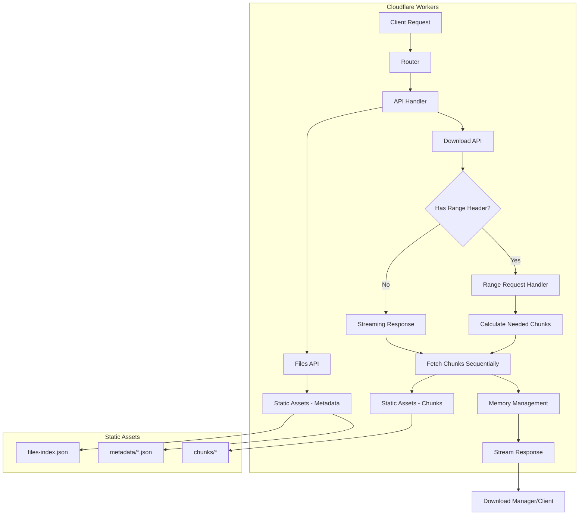

## 🔄 请求处理流程

### 1. 主请求路由流程

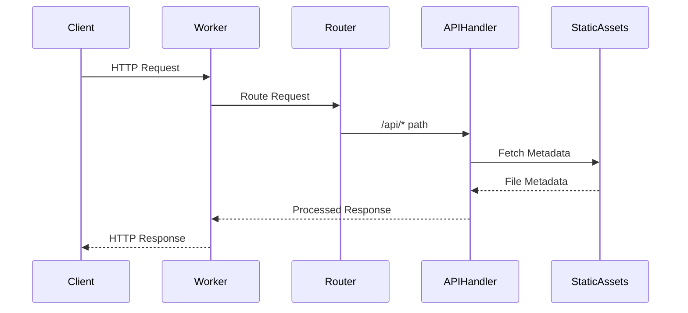

### 2. 流式下载流程（无Range请求）

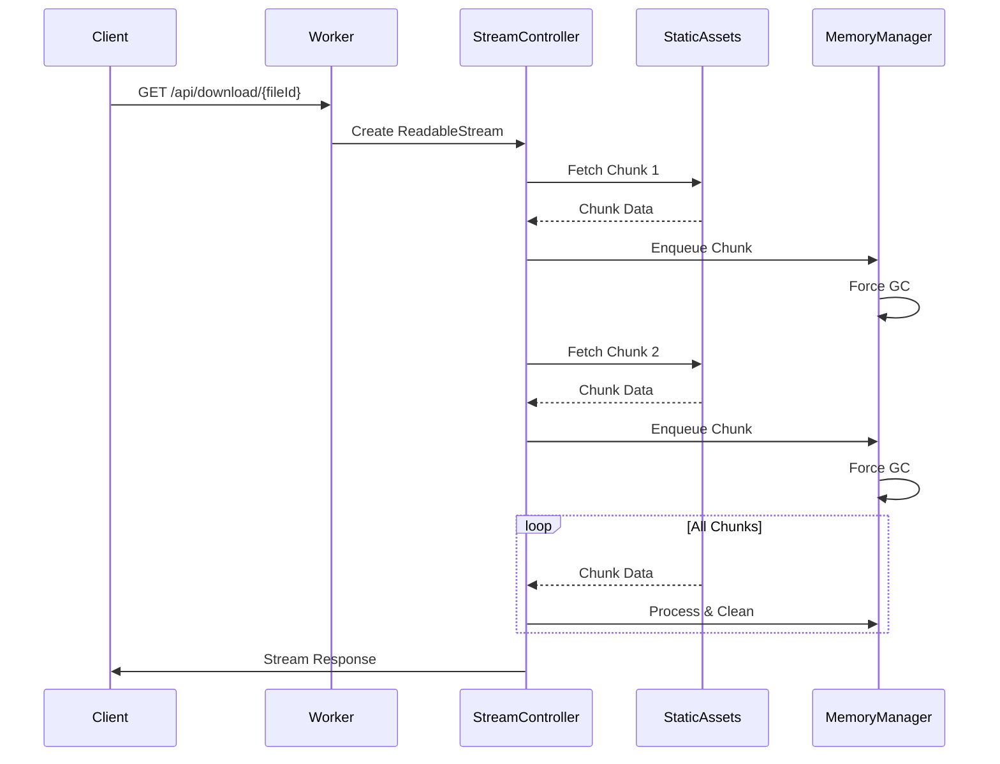

### 3. Range请求处理流程

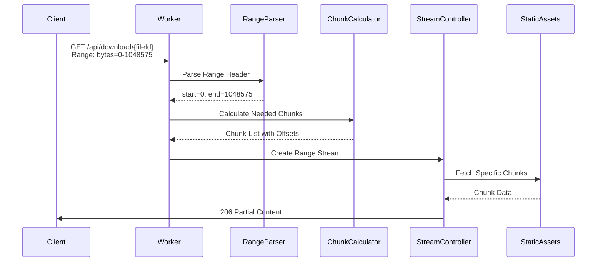

## 💾 内存管理优化

### 内存使用策略

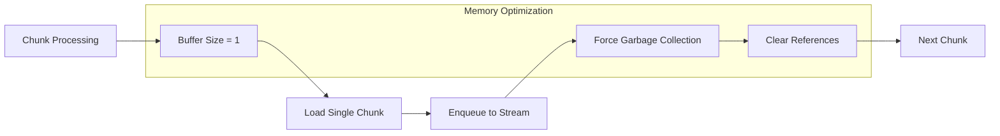

### 关键优化点

1. **极简缓冲区**: `bufferSize = 1` - 一次只处理一个分块
2. **强制垃圾回收**: 使用 `setTimeout(resolve, 0)` 触发垃圾回收
3. **即时清理**: 每个分块处理后立即清理内存引用
4. **避免内存泄漏**: 确保所有变量在作用域结束时被释放

## 📁 文件结构

```
workers-migration/
├── src/
│   └── index.js              # 主 Worker 代码
├── static/
│   ├── files-index.json      # 文件索引
│   ├── metadata/             # 文件元数据
│   │   └── {fileId}.json
│   └── chunks/               # 文件分块
│       └── {chunkId}
├── wrangler.toml            # Worker 配置
├── package.json             # 项目配置
└── README.md               # 本文档
```

## 🔧 核心功能

### 1. 文件列表 API

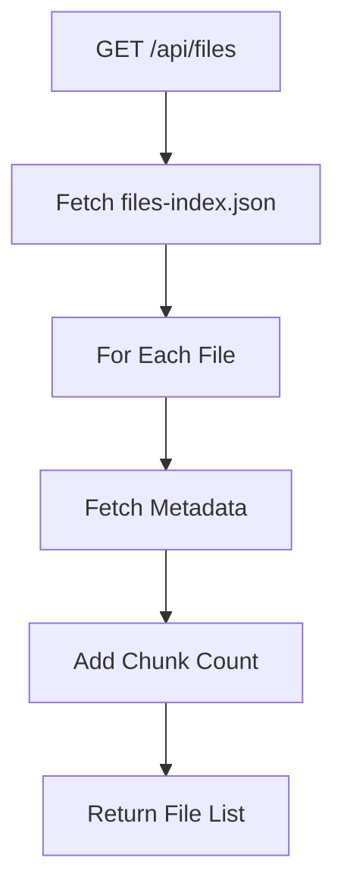

### 2. 文件下载 API

#### 完整文件下载

```mermaid
graph TD
    A[GET /api/download/{fileId}] --> B{Has Range?}
    B -->|No| C[Create Streaming Response]
    C --> D[Process Chunks Sequentially]
    D --> E[Return 200 OK]
```

#### Range 请求下载

```mermaid
graph TD
    A[GET /api/download/{fileId}] --> B{Has Range?}
    B -->|Yes| C[Parse Range Header]
    C --> D[Calculate Required Chunks]
    D --> E[Stream Partial Content]
    E --> F[Return 206 Partial Content]
```

### 3. 请求方法支持

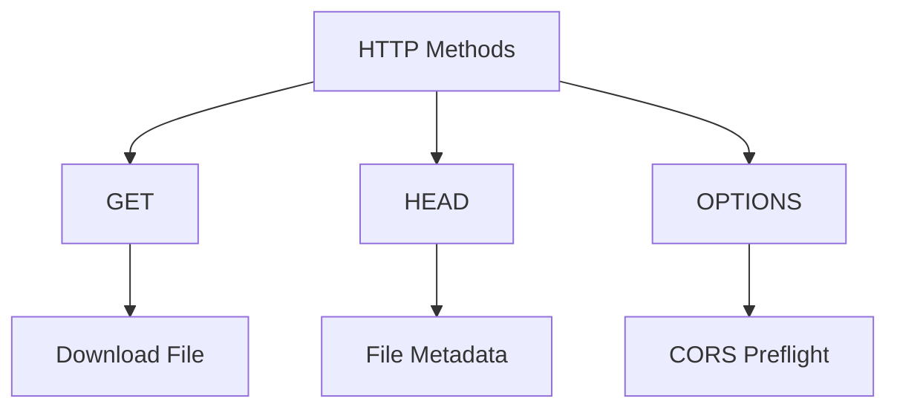

## 🚀 部署指南

### 1. 环境准备

```bash
# 安装 Wrangler CLI
npm install -g wrangler

# 登录 Cloudflare
wrangler login
```

### 2. 项目设置

```bash
# 进入项目目录
cd workers-migration

# 安装依赖
npm install

# 配置 Worker
wrangler config
```

### 3. 部署流程

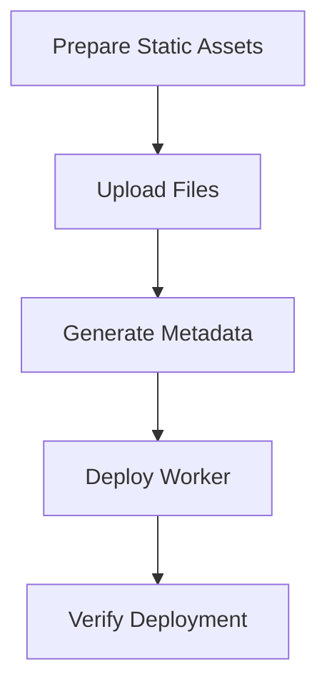

### 4. 部署命令

```bash
# 开发模式
npm run dev

# 部署到生产环境
npm run deploy

# 查看日志
npm run tail
```

## 📊 性能特性

### 内存使用对比

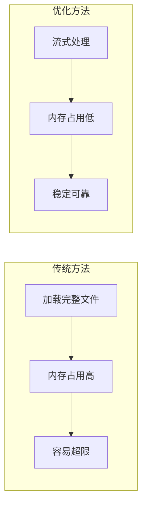

### 下载管理器兼容性

- ✅ **IDM (Internet Download Manager)**
- ✅ **FDM (Free Download Manager)**
- ✅ **浏览器原生下载**
- ✅ **wget / curl**
- ✅ **移动端下载器**

## 🔍 技术细节

### Content-Length 保持策略

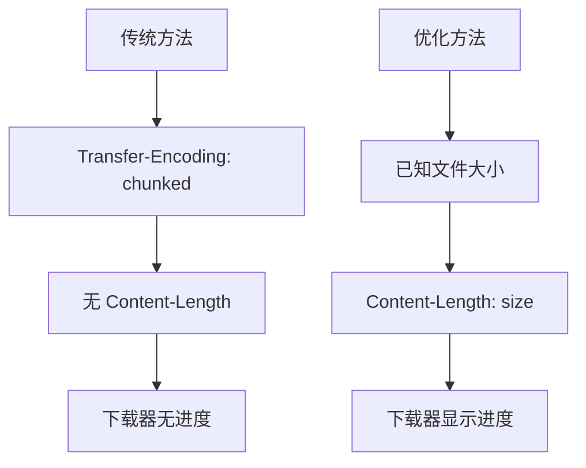

### 错误处理机制

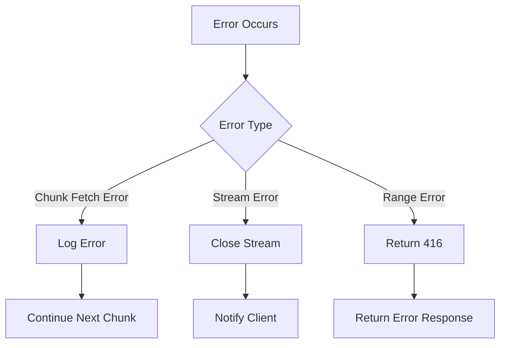

## 📝 API 文档

### 端点列表

| 方法 | 端点 | 描述 | 响应 |
|------|------|------|------|
| GET | `/api/files` | 获取文件列表 | 200 JSON |
| GET | `/api/download/{fileId}` | 下载文件 | 200 Stream |
| HEAD | `/api/download/{fileId}` | 文件元数据 | 200 Headers |
| OPTIONS | `/api/download/{fileId}` | CORS 预检 | 200 OK |

### 响应头部

```http
Content-Type: application/octet-stream
Content-Disposition: attachment; filename="..."
Content-Length: 2055561981
Accept-Ranges: bytes
Access-Control-Allow-Origin: *
X-File-Size: 2055561981
```

## 🛠️ 开发指南

### 本地开发

```bash
# 启动开发服务器
npm run dev

# 在另一个终端测试
curl http://localhost:8787/api/files
```

### 调试技巧

```bash
# 查看实时日志
npm run tail

# 测试 Range 请求
curl -H "Range: bytes=0-1023" http://localhost:8787/api/download/{fileId}
```

## 📈 监控和日志

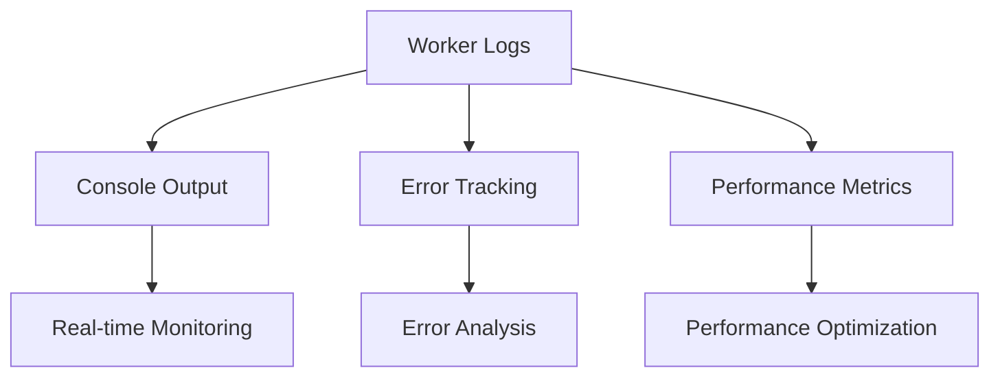

## 🎯 最佳实践

1. **分块大小**: 建议每个分块 5-10MB
2. **内存管理**: 始终使用 `bufferSize = 1`
3. **错误处理**: 实现完整的错误捕获和日志
4. **CORS 配置**: 支持跨域请求
5. **监控**: 实时监控 Worker 性能

## 🔒 安全考虑

- ✅ 文件访问权限控制
- ✅ CORS 配置
- ✅ 错误信息不暴露敏感数据
- ✅ 请求大小限制
- ✅ 恶意请求防护

## 📞 支持

如有问题，请查看 Cloudflare Workers 文档或提交 Issue。

---

*最后更新: 2025-08-15*